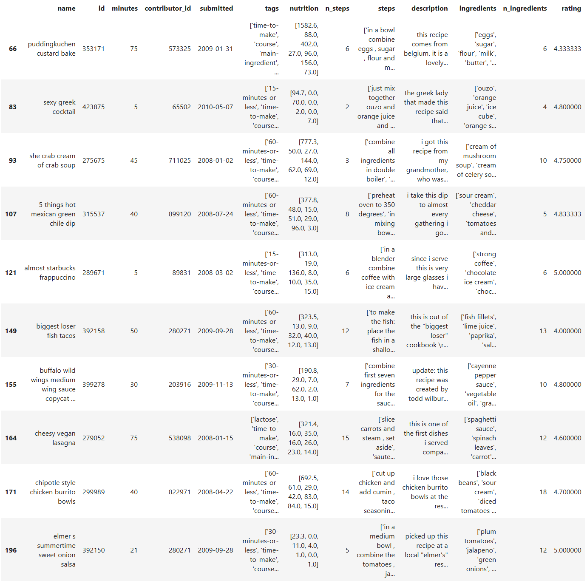

# Introduction

The data that I'm going through in this project is a collection of recipe data from the website [Food.com](https://food.com).
The data contains details such as the number of steps, number of ingredients, nutritional information, time to cook, and much more. 
This project aims to try to predict a recipe's average rating based on the number of steps, number of ingredients, and time to cook.

The reason these specific categories were chosen was because I was curious whether increasing cooking complexity
has an impact on how people rated the recipe.

# Data Cleaning and Exploratory Data Analysis

### Cleaning

The first step to exploring this problem comes in the form of cleaning the data. The initial data set is very messy 
containing every single recipe and every single comment associated with it. Generally these comments come in the form 
of a rating of 0, which is why all ratings with value 0 were ignored.

Two other issues that this dataset had were recipes that were either overly short or long. For example, there was a 
recipe for vegan parmesan that was listed as taking 0 minutes to complete. As this would lead to weird complexity calculations it was ignored.
Additionally, all recipes that took longer than 10 hours to complete were also ignored. This was done as it seemed reasonable that
the majority of recipes that the average person would consider making to be done under 10 hours. 

The reasoning for considering the average person's maximum cooking time is because it is very likely that a chef that
is willing to accept long cooking times to skew the ratings of the recipe. From a closer inspection of the longer recipes,
you would find that many of the longer recipes are ones for making wine, extracts, etc. from scratch. A notably funny "recipe"
was titled "How to preserve a husband" which you can find [here](https://www.food.com/recipe/how-to-preserve-a-husband-447963).

Some additional cleaning work on the data included dropping unneeded data such as the actual review, the user id of the review poster,
date of the review, and the individual rating as this project is aiming to predict the average rating of a recipe. After the review
data except the average rating was dropped, we finally have a deduplicated dataset that we can use to do data analysis with.

The final thing to note here is that only recipes with 5 or more reviews were kept, in order to prevent low review recipes 
from impacting the outcome.

Here's a look at the head of the cleaned dataset:

### Exploratory Data Analysis

The 4 columns that we are interested in are the n_steps, n_ingredients, minutes, and rating (average) columns.

Let's take a closer look at each column.

##### Time Distribution

<iframe
  src="src/min_dist.htm"
  width="800"
  height="600"
  frameborder="0"
></iframe>

As you can see the majority of recipes took 2 hours to make, with the majority of them taking between 20 and 60 minutes.
There is a very long tail of the longer recipes, but that is to be expected for things such as stock, stews, and other slow
cook recipes would still be considered by our 10 hours margin.

##### Ingredient Count

<iframe
  src="src/ing_dist.htm"
  width="800"
  height="600"
  frameborder="0"
></iframe>

Most recipes took between 6 and 11 ingredients, with the max stretching out to 30 ingredients. These outliers consisted
mainly of recipes with lots of spices where the author decided to list out every single spice, for example the recipe for
north african meatballs (boulettes).

##### Steps Count

<iframe
  src="src/steps_dist.htm"
  width="800"
  height="600"
  frameborder="0"
></iframe>

Most recipes took less than 21 steps to complete, with the upper bound being 80. Upon closer inspection it seems that
the outliers are mostly data errors. 

##### Rating

<iframe
  src="src/rating_dist.htm"
  width="800"
  height="600"
  frameborder="0"
></iframe>

<iframe
  src="src/rating_dist_bar.htm"
  width="800"
  height="600"
  frameborder="0"
></iframe>

Perhaps the most important data point, the rating that we're trying to predict. There's an overwhelming favorite towards
a rating of 5, even when we consider that only recipes with 5+ reviews were kept. We will discuss how this impacted this 
project at the end of this page.

#### Comparison with Rating

##### Minutes vs Rating

<iframe
  src="src/min_vs_rat.htm"
  width="800"
  height="600"
  frameborder="0"
></iframe>

##### Ingredients vs Rating

<iframe
  src="src/ing_vs_rat.htm"
  width="800"
  height="600"
  frameborder="0"
></iframe>

##### Steps vs Rating

<iframe
  src="src/steps_vs_rat.htm"
  width="800"
  height="600"
  frameborder="0"
></iframe>

These scatterplots don't show a clear correlation between any of the components clearly, but I believed that I could still
have done a prediction based on a more complex calculation of recipe complexity.

# Framing a Prediction Problem

The prediction problem that this project is tackling is a regression problem, specially the prediction of the average rating 
of a recipe given only its minutes to completion, number of ingredients, and number of steps. The reason I chose rating
as the prediction variable was because I wanted to know if people would rate recipes with higher complexity lower than those 
which are easier to make.

# Baseline Model

The baseline model is multiple linear regression with our 3 quantitative columns. There was no need for imputation as all 
columns are fully filled. This model performed quite poorly as expected, with a R^2 value of only 0.00887. While I don't 
think this model is particularly good at predicting the average rating, I will leave the final discussion to the reflection 
at the end of the page.

# Final Model

The final model consists of 4 columns of data: number of steps, number of ingredients to the fourth power, minutes to completion squared,
and a new column called complexity to the fourth power. Why these powers? Your guess is as good as mine. This model performed 32% better than the baseline model, with a R^2 value of 
0.01172. While this is still horrible, we learned that the rating is slightly more dependent on the number of ingredients as well as the 
time it takes rather than the number of steps. This model consisted of a polynomial multiple linear regression pipeline that used grid search
to find the best hyperparameter for the polynomial function. While this polynomial function ended up being a linear function in the end, we 
were still able to learn a little more about the dataset. Now the question on your mind is probably what the complexity variable is. 

#### How do you measure a recipe's complexity?

This was a hard question that I tried to answer during my exploration in this dataset. I knew that a recipe's complexity
is certainly related to the three columns that I chose at the beginning, but figuring out their relation is something that
I'm still not certain that I have. I will explain the major functions that I've tried and what the result was.

##### steps + ingredients + time

The first thing I tried. Perhaps a recipe's complexity really is as simple as adding them together? Of course not. This naive
approach faces a major flaw: all 3 of the factors have different scales. Would a recipe that took 9 hours of slow cooking be as complex
as a freshly baked cake? Unlikely. Quite obviously, this function was thrown out rather quickly.

##### (steps * ingredients) / log(time)

A few jumps ahead, we come to realize that an increasingly long time doesn't necessarily make it that much more complex. Going back to 
our slow cooking example, once you leave it to cook you don't really have to do anything with it. As such, it is more reasonable to 
focus more on the initial minutes rather than the later minutes. Another thing I realized is that it makes much more sense for time to be
a denominator, given that the more stuff you have to do within a small timeframe the more complex it has to be.

###### log(ingredients + 1) / steps ^ 2

Final formula used for complexity. Minutes has gone out of the window from empirical testing, every time I've tried to add time to the 
equation the score of the model went down. The intuitive understanding of this is that the log of the number of ingredients is a better 
reflection of the complexity. This is because recipes with a large quantity of ingredients often end up listing a large quantity of
spices that get mixed together which is not complicated at all. As such, we would only want to focus on the core initial ingredients
that make up the majority of the dish. The +1 is only there to account for the 1 ingredient recipes such that the numerator doesn't become 0.

Now why is steps in the bottom, and why squared? It occurred to me that perhaps more steps would actually decrease the complexity of a recipe
as it likely makes it more clear on what needs to be done for successful completion. Intuitively, this can be understood by a hypothetical recipe
for baking a three layer cake. It would make a recipe easier if there are many steps that detail the preparation, mixing, and cooking process
rather than just a few small steps that contain the main idea. The square is there to amplify this effect and from empirical testing 
has provided decent results.

# Reflection

The biggest question to answer at the end of this project whether there is correlation between recipe complexity and its rating,
and in the case that there is why we were unable to find such data.

### Is there a correlation at all?

From the data that we have, it is hard to tell whether this correlation exists. However, I believe that there is indeed a correlation.
This is primarily due to the idea that an individual's willingness to cook a dish stems primarily from two factors: its taste and how
hard it is to cook said dish. The reason that people are willing to pay money for an easy recipe is so that they don't have to do it themselves.
Take for example the cafe industry. The majority of their sales products are by no means hard to prepare but the taste of the end
product generally doesn't blow the consumer out of the park either. It makes intuitive sense then that there must be some tradeoff
between taste and a willingness to prepare a dish. If it were easy to prepare a well tasting dish, people would commonly do it and as
such the rating of the dish should go up. A big example I can think of is the recipe for a grilled cheese sandwich. It's generally relatively
simple to prepare, but the taste of the dish provides a sense of comfort that improves the experience considerably and such would be rated highly.

### Why aren't we seeing correlation in the data?

I think the biggest reason that we don't see any correlation stems from the following factors: unwillingness to submit ratings,  
survivorship bias from the submitted ratings, and human tendency to rate things higher than their intended value. Let's break down
these factors.

#### Unwillingness to submit ratings

I ask you to consider how often you've left a review on a recipe site. It's highly likely that you've never left a review on
a recipe site that you've visiting. I certainly for a fact never left a review. I think this is due to a few factors.

To be willing to leave a review on a site, it is highly likely that your experience was either excellent or horrendous. In
the case of recipes, from the rating data that we have we see that the overwhelming majority of reviews were five stars.
It is highly unlikely that every single individual overwhelmingly enjoyed the end result that they created, but rather that
those that did wanted share that joy with the creator of the recipe. As such the submitted ratings cannot be said to be
an accurate reflection of the real world state.

#### Survivorship Bias

Continuing on from the last sentence of the previous section, what we have encountered is a clear example of survivorship bias.
As we only know the ratings of the individuals who were willing to submit reviews rather than of all the individuals who
tried the recipe, we are unable to form a conclusive statement on whether complexity had an effect on how well a recipe is
perceived.

#### Rating things higher than their intended value

This factor is going to be primarily from "practical experience." Please think on a time your were asked to give a rating
on something, for example on how well someone gave a speech on a scale from 1 to 10. In the case that you thought that 
their performance was average, how likely is it that your answer was 7? However, we logically know that the average
rating from a scale of 1 to 10 should not be 7 but 5 instead. However, why is it that we rated the performance a 7?
I believe that this primarily stems from the human preference to appease others rather to open a path to conflict,
and as such we are more likely to give out higher numeric results than should be ascribed to the task we were told to rate.

# Conclusion

While our model was poor in that it wasn't all that great at predicting data, I believe it was important that I stick with
this subject rather than switch to another question. While the results are not impressive, the lack of meaningful insight
is also an important subject for academic discussion and exploration. By publishing my failures, I can prevent others from
making the same failures and have an easier journey ahead.

Thanks for reading!